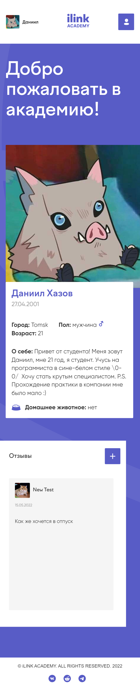

# Profile_test

This is a training project for **XXX** company

## Screenshots

### Desktop

#### Authorization page


#### Recovery password page


#### User page


#### Students page


#### Comments page


#### About page


### Mobile

#### Authorization pages

 

#### User page



#### Students page


#### Comments page


#### About page


### Forms

#### Add comment


#### Edit comment


### Notifications

#### Success notification


#### Error notification


#### Error bottom notification


## Functional

* Authorization
* Displaying information about a person in the form of a profile
* Adding and viewing comments in slider
* Viewing and filtering participants
* Viewing and filtering comments
* Changing the status and text of the comment
* Editing your profile
* Notifications appear

## Getting Started

These instructions will get you a copy of the project up and running on your local machine for development and testing purposes. See deployment for notes on how to deploy the project on a live system.


### Installing

A step by step series of examples that tell you how to get a development env running

To start

```
yarn install
```

And repeat

```
yarn start
```
## Technology stack

* [React](https://ru.reactjs.org/) - UI library
* [Create React App](https://github.com/facebook/create-react-app) - development environment
* [TypeScript](https://www.typescriptlang.org/) - programming language
* [Effector](https://effector.dev/) - state manager
* [SCSS](https://sass-scss.ru/) - CSS preprocessor
* [Feature-Sliced Design](https://feature-sliced.design/en/) - Architectural methodology for frontend projects

## Company and teachers

Thanks for the practice 

## License

Copyright (c) 2022 Khazov Daniil.

This project is provided as is without any warranties. Use at your own risk.